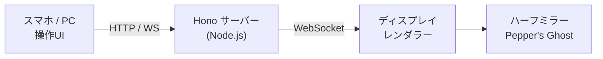

# Vitrine

VRMモデルをデスクトップにフィギュアのように飾るシステム。

Raspberry Pi 5 が小型ディスプレイにアバターを描画し、ハーフミラー越しに Pepper's Ghost 方式で浮遊するフィギュアを実現する。操作はスマホ/PC から LAN 経由の Web UI で行う。

## アーキテクチャ

- **サーバー** — Hono (Node.js) による REST API + WebSocket。SQLite で状態管理
- **ディスプレイレンダラー** — Three.js + @pixiv/three-vrm。Chromium キオスクモードで全画面描画
- **操作UI** — SolidJS 製の Web アプリ。VRM 選択、ポーズ変更、回転、スケール調整

## 技術スタック

| レイヤー | 技術 |
|---------|------|
| ランタイム | Node.js 24.x |
| パッケージ管理 | pnpm workspaces |
| バックエンド | Hono |
| 操作UI | SolidJS |
| 表示レンダラー | Three.js + @pixiv/three-vrm |
| ビルドツール | Vite |
| DB | SQLite (better-sqlite3) |

## ドキュメント

| ドキュメント | 内容 |
|-------------|------|
| [docs/architecture.md](docs/architecture.md) | 全体アーキテクチャ・パッケージ構成・データフロー |
| [docs/server.md](docs/server.md) | バックエンドサーバー設計 |
| [docs/protocol.md](docs/protocol.md) | REST API・WebSocket 通信プロトコル |
| [docs/database.md](docs/database.md) | データベース・ストレージ設計 |
| [docs/display-renderer.md](docs/display-renderer.md) | ディスプレイレンダラー設計 |
| [docs/control-ui.md](docs/control-ui.md) | 操作UI設計 |
| [docs/hardware.md](docs/hardware.md) | ハードウェア構成・筐体設計・BOM |
| [docs/deployment.md](docs/deployment.md) | デプロイ・運用 |

## ライセンス

[MIT](LICENSE)
