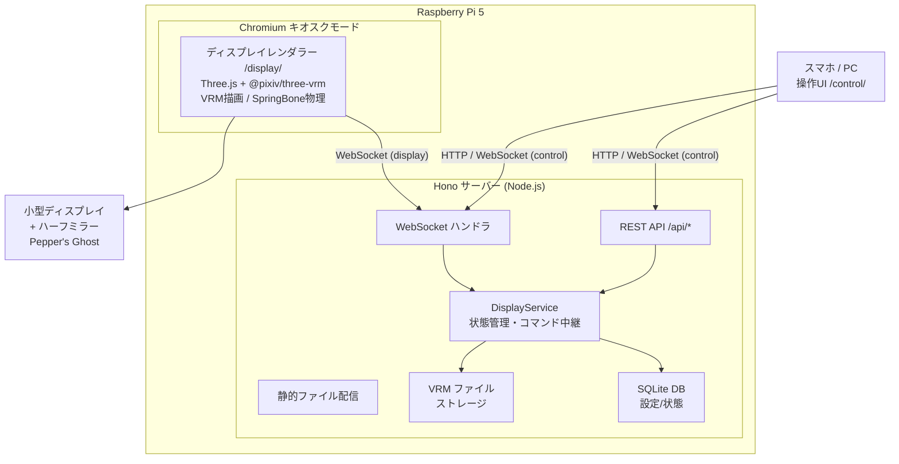
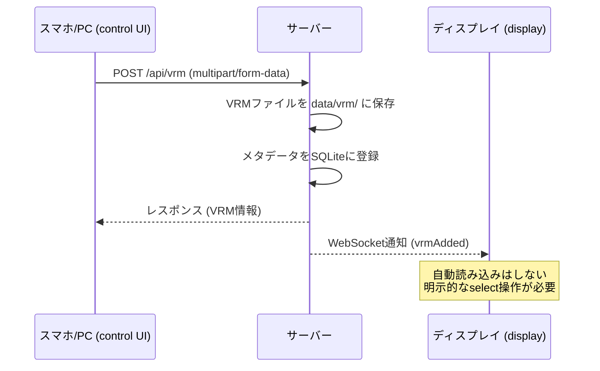
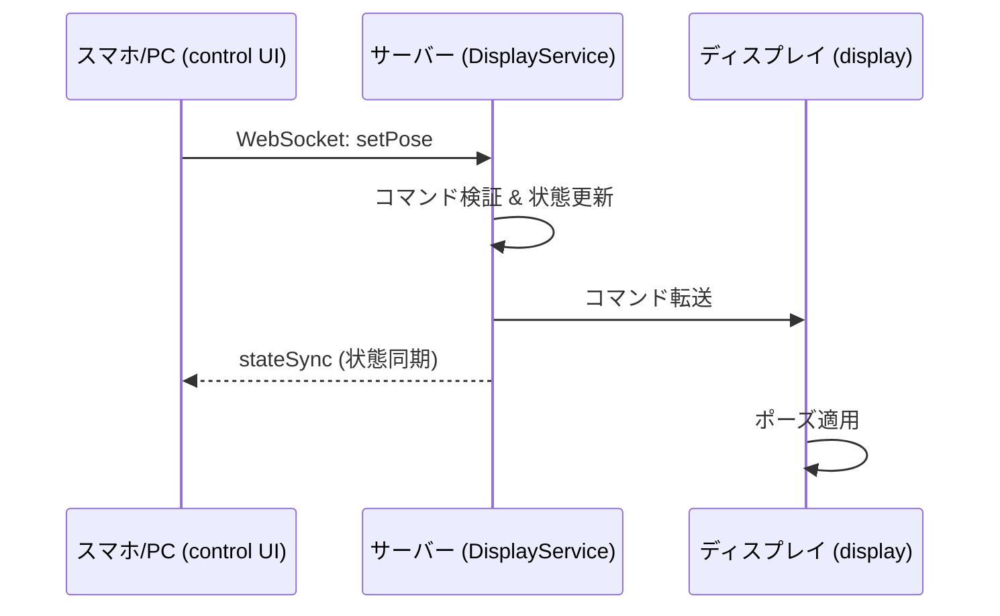
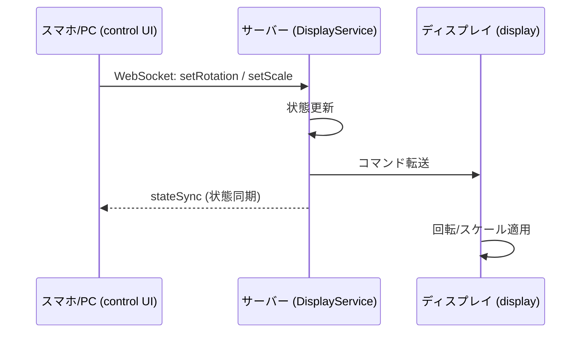

# 全体アーキテクチャ設計書

## 概要

VRMモデルをデスクトップにフィギュアのように飾るシステム。Raspberry Pi 5が小型ディスプレイにアバターを描画し、ハーフミラー越しにPepper's Ghost方式で浮遊するフィギュアを実現する。操作はスマホ/PCからLAN経由のWeb UIで行う。

## システム構成図



## パッケージ構成

pnpm workspaces によるモノレポ構成。

```
holo_figure/
├── package.json              # ワークスペースルート
├── pnpm-workspace.yaml
├── tsconfig.base.json        # 共通TypeScript設定
├── .env                      # 環境変数
├── docs/                     # 設計書
├── data/                     # ランタイムデータ（gitignore）
│   ├── holo_figure.db        # SQLiteデータベース
│   └── vrm/                  # アップロードされたVRMファイル
└── packages/
    ├── shared/               # 共有型定義・プロトコル・定数
    │   ├── package.json
    │   ├── tsconfig.json
    │   └── src/
    │       ├── index.ts
    │       ├── types.ts      # 共有型定義
    │       ├── protocol.ts   # WebSocketプロトコル型
    │       └── constants.ts  # 共有定数
    ├── server/               # Honoバックエンド
    │   ├── package.json
    │   ├── tsconfig.json
    │   └── src/
    │       ├── index.ts      # エントリーポイント
    │       ├── app.ts        # Honoアプリ定義
    │       ├── db/           # データベース層
    │       ├── routes/       # APIルート
    │       ├── ws/           # WebSocketハンドラ
    │       └── services/     # ビジネスロジック
    ├── display/              # ディスプレイレンダラー（Three.js）
    │   ├── package.json
    │   ├── tsconfig.json
    │   ├── index.html
    │   ├── vite.config.ts
    │   └── src/
    │       ├── main.ts       # エントリーポイント
    │       ├── scene.ts      # Three.jsシーン管理
    │       ├── vrm-loader.ts # VRM読み込み
    │       ├── ws-client.ts  # WebSocketクライアント
    │       └── performance.ts # パフォーマンスモニタ
    └── control/              # 操作UI（SolidJS）
        ├── package.json
        ├── tsconfig.json
        ├── index.html
        ├── vite.config.ts
        └── src/
            ├── main.tsx      # エントリーポイント
            ├── App.tsx       # ルートコンポーネント
            ├── components/   # UIコンポーネント
            ├── hooks/        # カスタムフック
            └── styles/       # CSS
```

## データフロー

### VRMアップロードフロー



### ポーズ変更フロー



### 回転・スケール変更フロー



## 技術スタック選定理由

| レイヤー | 選定技術 | バージョン | 理由 |
|---------|---------|-----------|------|
| ランタイム | Node.js LTS | 24.x | 全レイヤーでTypeScriptを統一。Pi 5で安定動作 |
| パッケージ管理 | pnpm workspaces | 10.x | ディスク効率が良いモノレポ。Pi SDカード向き |
| バックエンド | Hono | 4.x | ~14KBの軽量フレームワーク。WebSocket内蔵、高速起動 |
| 操作UI | SolidJS | 1.9.x | ~7KBのランタイム。React/Vueより軽量。JSX使える |
| 表示レンダラー | Three.js + @pixiv/three-vrm | 0.183.x / 3.4.x | フレームワークなしで最小オーバーヘッド |
| ビルドツール | Vite | 8.x | Rolldownベースの高速ビルド |
| 型システム | TypeScript | 5.9.x | 安定版 |
| DB | SQLite (better-sqlite3) | 12.x | 設定不要、単一ファイル、書き込み競合安全 |
| ファイル保存 | ローカルファイルシステム | - | 最もシンプル |

## 設計方針

### 軽量・省リソース

Raspberry Pi 5での動作を前提とし、すべてのレイヤーで軽量な技術を選定。不要な抽象化やフレームワークを避け、最小限のオーバーヘッドを目指す。

### シンプルなアーキテクチャ

- 単一プロセスのNode.jsサーバーがすべてを配信
- データベースはSQLite単一ファイル
- ファイルストレージはローカルファイルシステム
- 外部サービス依存なし

### リアルタイム通信

- REST APIはCRUD操作（VRM管理、ポーズプリセット管理）に使用
- WebSocketはリアルタイム操作（ポーズ変更、回転、スケール、状態同期）に使用
- WebSocketクライアントには「control」と「display」の2つのロールがある

### 段階的品質調整

- ディスプレイレンダラーにFPS監視機能を内蔵
- FPSが目標を下回った場合、描画品質を自動的に下げる
- Pi 5の限られたGPU性能に適応
