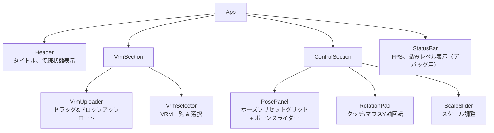

# 操作UI設計書

## 概要

SolidJSを使用した操作UIWebアプリケーション。スマホ/PCのブラウザからLAN経由でアクセスし、VRMモデルの選択、ポーズ変更、回転、スケール調整を行う。

## コンポーネント設計

### コンポーネントツリー



### App (`App.tsx`)

ルートコンポーネント。WebSocket接続と状態管理を統括する。

```tsx
import { Component } from "solid-js";
import { useDisplayConnection } from "./hooks/useDisplayConnection";

const App: Component = () => {
  const { state, sendCommand, connected } = useDisplayConnection();

  return (
    <div class="app">
      <Header connected={connected()} />
      <main>
        <VrmSection
          currentVrmId={state().currentVrmId}
          onSelect={(id) => sendCommand("selectVrm", { vrmId: id })}
        />
        <ControlSection
          state={state()}
          onSetPose={(pose) => sendCommand("setPose", pose)}
          onSetRotation={(y) => sendCommand("setRotation", { y })}
          onSetScale={(scale) => sendCommand("setScale", { scale })}
          onResetPose={() => sendCommand("resetPose", {})}
        />
      </main>
    </div>
  );
};
```

### VrmUploader (`components/VrmUploader.tsx`)

ドラッグ&ドロップまたはファイル選択でVRMをアップロード。

**機能:**
- ドラッグ&ドロップエリア
- ファイル選択ボタン（フォールバック）
- アップロード進捗表示
- .vrm拡張子チェック
- ファイルサイズ上限表示（100MB）

```tsx
const VrmUploader: Component = () => {
  const [uploading, setUploading] = createSignal(false);
  const [dragOver, setDragOver] = createSignal(false);

  const upload = async (file: File) => {
    if (!file.name.endsWith(".vrm")) return;
    setUploading(true);

    const formData = new FormData();
    formData.append("file", file);

    await fetch("/api/vrm", { method: "POST", body: formData });
    setUploading(false);
  };

  return (
    <div
      class={`uploader ${dragOver() ? "drag-over" : ""}`}
      onDragOver={(e) => { e.preventDefault(); setDragOver(true); }}
      onDragLeave={() => setDragOver(false)}
      onDrop={(e) => {
        e.preventDefault();
        setDragOver(false);
        const file = e.dataTransfer?.files[0];
        if (file) upload(file);
      }}
    >
      <p>{uploading() ? "アップロード中..." : "VRMファイルをドロップ"}</p>
      <input
        type="file"
        accept=".vrm"
        onChange={(e) => {
          const file = e.target.files?.[0];
          if (file) upload(file);
        }}
      />
    </div>
  );
};
```

### VrmSelector (`components/VrmSelector.tsx`)

アップロード済みVRMの一覧と選択。

**機能:**
- VRM一覧表示（タイトル、ファイルサイズ）
- 選択中VRMのハイライト
- 削除ボタン（確認ダイアログ付き）

```tsx
interface Props {
  currentVrmId: string | null;
  onSelect: (id: string) => void;
}

const VrmSelector: Component<Props> = (props) => {
  const [vrms, setVrms] = createSignal<VrmInfo[]>([]);

  // 初回ロード
  onMount(async () => {
    const res = await fetch("/api/vrm");
    const data = await res.json();
    setVrms(data.vrms);
  });

  // WebSocketのvrmAdded/vrmDeletedイベントでリスト更新
  // → useDisplayConnection から受け取る

  return (
    <div class="vrm-selector">
      <For each={vrms()}>
        {(vrm) => (
          <div
            class={`vrm-item ${props.currentVrmId === vrm.id ? "selected" : ""}`}
            onClick={() => props.onSelect(vrm.id)}
          >
            <span class="vrm-title">{vrm.title}</span>
            <span class="vrm-size">{formatFileSize(vrm.fileSize)}</span>
            <button
              class="delete-btn"
              onClick={(e) => {
                e.stopPropagation();
                if (confirm(`${vrm.title} を削除しますか？`)) {
                  fetch(`/api/vrm/${vrm.id}`, { method: "DELETE" });
                }
              }}
            >
              ×
            </button>
          </div>
        )}
      </For>
    </div>
  );
};
```

### PosePanel (`components/PosePanel.tsx`)

ポーズプリセットの選択とボーン単位の微調整。

**機能:**
- プリセットグリッド表示
- プリセット選択でポーズ適用
- ボーンスライダー（主要ボーンのX/Y/Z回転）
- リセットボタン
- 現在のポーズをプリセットとして保存

**主要ボーン:**

```typescript
const ADJUSTABLE_BONES = [
  { name: "head",          label: "頭" },
  { name: "spine",         label: "背骨" },
  { name: "leftUpperArm",  label: "左上腕" },
  { name: "rightUpperArm", label: "右上腕" },
  { name: "leftLowerArm",  label: "左前腕" },
  { name: "rightLowerArm", label: "右前腕" },
  { name: "leftUpperLeg",  label: "左太もも" },
  { name: "rightUpperLeg", label: "右太もも" },
  { name: "leftLowerLeg",  label: "左すね" },
  { name: "rightLowerLeg", label: "右すね" },
] as const;
```

**ボーンスライダー:**

各ボーンのX/Y/Z軸回転を -180° 〜 180° のスライダーで調整。内部的にはオイラー角→クォータニオン変換を行う。

```typescript
import { Euler, Quaternion } from "three/src/math";

function eulerToQuaternion(x: number, y: number, z: number): [number, number, number, number] {
  const euler = new Euler(
    (x * Math.PI) / 180,
    (y * Math.PI) / 180,
    (z * Math.PI) / 180,
  );
  const q = new Quaternion().setFromEuler(euler);
  return [q.x, q.y, q.z, q.w];
}
```

### RotationPad (`components/RotationPad.tsx`)

タッチ/マウスでモデルのY軸回転を制御する円形パッド。

**機能:**
- 円形のタッチエリア
- 水平ドラッグでY軸回転
- 慣性なし（ドラッグ量に比例した即時回転）
- 現在の回転角度を視覚的に表示

```tsx
const RotationPad: Component<{ rotation: number; onRotate: (y: number) => void }> = (props) => {
  let startX = 0;
  let startRotation = 0;

  const onPointerDown = (e: PointerEvent) => {
    startX = e.clientX;
    startRotation = props.rotation;
    (e.target as HTMLElement).setPointerCapture(e.pointerId);
  };

  const onPointerMove = (e: PointerEvent) => {
    if (!(e.target as HTMLElement).hasPointerCapture(e.pointerId)) return;
    const dx = e.clientX - startX;
    const sensitivity = 0.01; // 1px = 0.01rad
    props.onRotate(startRotation + dx * sensitivity);
  };

  return (
    <div
      class="rotation-pad"
      onPointerDown={onPointerDown}
      onPointerMove={onPointerMove}
    >
      <div class="rotation-indicator" style={{ transform: `rotate(${props.rotation}rad)` }} />
    </div>
  );
};
```

### ScaleSlider (`components/ScaleSlider.tsx`)

スケール調整スライダー。

```tsx
const ScaleSlider: Component<{ scale: number; onScale: (v: number) => void }> = (props) => {
  return (
    <div class="scale-slider">
      <label>スケール: {props.scale.toFixed(2)}</label>
      <input
        type="range"
        min="0.1"
        max="3.0"
        step="0.05"
        value={props.scale}
        onInput={(e) => props.onScale(Number(e.target.value))}
      />
    </div>
  );
};
```

## WebSocketフック設計

### `useDisplayConnection`

WebSocket接続管理と状態同期を行うフック。

```typescript
import { createSignal, onCleanup } from "solid-js";
import type { DisplayState, WsMessage } from "@holo-figure/shared";

function useDisplayConnection() {
  const [state, setState] = createSignal<DisplayState>({
    currentVrmId: null,
    rotation: { y: 0 },
    scale: 1.0,
    pose: null,
  });
  const [connected, setConnected] = createSignal(false);
  const [vrms, setVrms] = createSignal<VrmInfo[]>([]);

  let ws: WebSocket | null = null;
  let reconnectTimer: number | null = null;
  let reconnectDelay = 1000;

  function connect() {
    const protocol = location.protocol === "https:" ? "wss:" : "ws:";
    ws = new WebSocket(`${protocol}//${location.host}/ws?role=control`);

    ws.onopen = () => {
      setConnected(true);
      reconnectDelay = 1000;
    };

    ws.onmessage = (evt) => {
      const msg: WsMessage = JSON.parse(evt.data);

      switch (msg.type) {
        case "stateSync":
          setState(msg.state);
          break;
        case "event":
          handleEvent(msg);
          break;
      }
    };

    ws.onclose = () => {
      setConnected(false);
      reconnectTimer = window.setTimeout(() => {
        reconnectDelay = Math.min(reconnectDelay * 2, 30000);
        connect();
      }, reconnectDelay);
    };
  }

  function handleEvent(msg: WsEvent) {
    switch (msg.event) {
      case "connected":
        setState(msg.payload.state);
        break;
      case "vrmAdded":
        setVrms((prev) => [...prev, msg.payload]);
        break;
      case "vrmDeleted":
        setVrms((prev) => prev.filter((v) => v.id !== msg.payload.id));
        break;
    }
  }

  function sendCommand(command: string, payload: unknown) {
    if (ws?.readyState === WebSocket.OPEN) {
      ws.send(JSON.stringify({ type: "command", command, payload }));
    }
  }

  connect();

  onCleanup(() => {
    ws?.close();
    if (reconnectTimer) clearTimeout(reconnectTimer);
  });

  return { state, connected, vrms, sendCommand };
}
```

## レスポンシブデザイン方針

### スマホ優先

- モバイルファーストでCSSを設計
- タッチ操作に最適化（十分なタップターゲットサイズ 44px以上）
- 縦スクロールレイアウト

### ブレークポイント

| 幅 | レイアウト |
|----|-----------|
| 〜640px | 1カラム（スマホ） |
| 641px〜 | 2カラム（タブレット/PC） |

### カラーテーマ

```css
:root {
  --bg-primary: #1a1a2e;
  --bg-secondary: #16213e;
  --bg-card: #0f3460;
  --text-primary: #e0e0e0;
  --text-secondary: #a0a0a0;
  --accent: #00d2ff;
  --accent-hover: #00b4d8;
  --danger: #e74c3c;
}
```

ダーク系のテーマでホログラフィックな雰囲気を演出。

## ファイル構成

```
packages/control/src/
├── main.tsx               # エントリーポイント
├── App.tsx                # ルートコンポーネント
├── components/
│   ├── Header.tsx
│   ├── VrmUploader.tsx
│   ├── VrmSelector.tsx
│   ├── PosePanel.tsx
│   ├── RotationPad.tsx
│   └── ScaleSlider.tsx
├── hooks/
│   └── useDisplayConnection.ts
└── styles/
    └── global.css
```

## 依存パッケージ

```json
{
  "dependencies": {
    "solid-js": "^1.9.11",
    "three": "^0.183.2",
    "@holo-figure/shared": "workspace:*"
  },
  "devDependencies": {
    "vite": "^8.0.0",
    "vite-plugin-solid": "^2.x",
    "typescript": "^5.9.0"
  }
}
```

注: `three` はクォータニオン計算（`Euler`, `Quaternion`）のために使用。Three.jsのtree-shakingにより、使用するクラスのみがバンドルされる。
