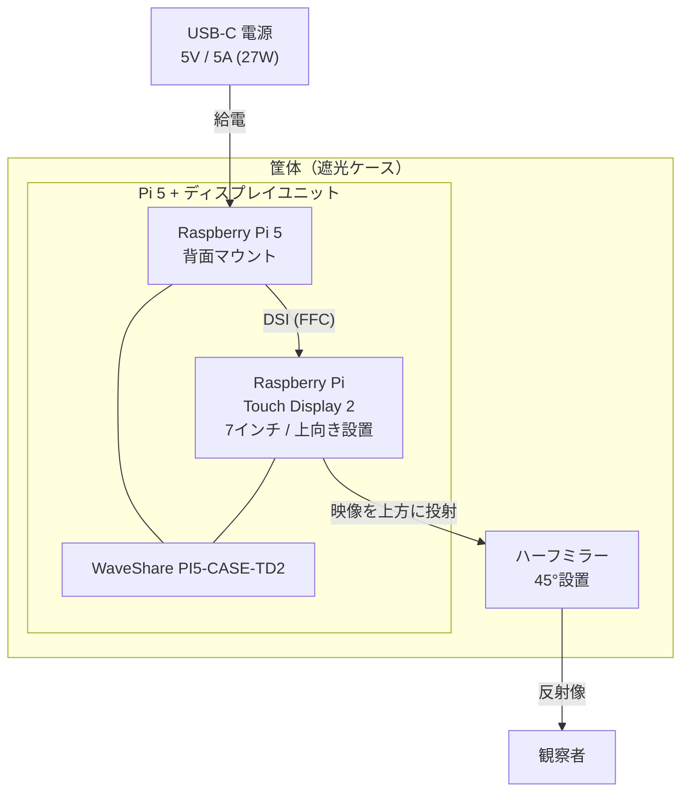
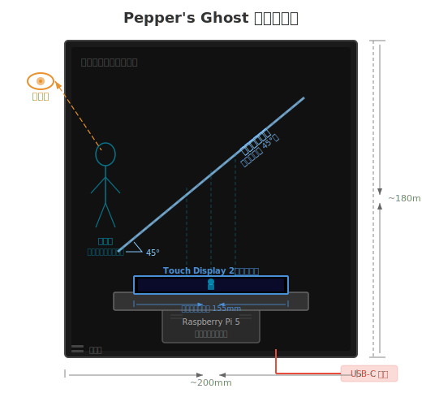
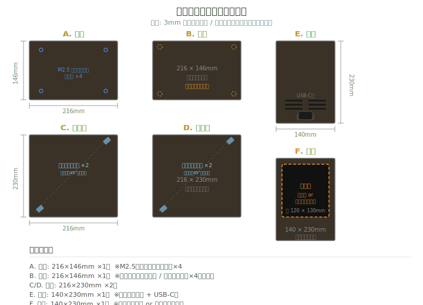
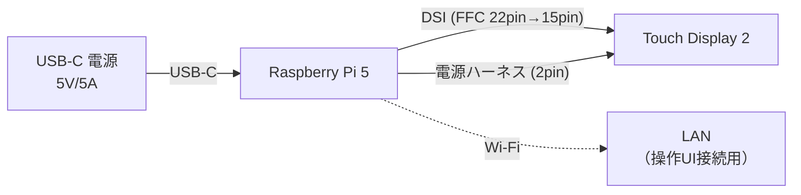

# ハードウェア設計書

## 概要

Pepper's Ghost 方式でVRMアバターを浮遊するフィギュアとして表示するための、ハードウェア構成・選定・組み立てを定義する。

## システム物理構成



## パーツ一覧（BOM）

| # | パーツ | 型番・製品名 | 入手先 | 参考価格 | 備考 |
|---|--------|-------------|--------|---------|------|
| 1 | シングルボードコンピュータ | Raspberry Pi 5 (4GB) | スイッチサイエンス等 | ¥10,120 | 8GBモデルでも可 |
| 2 | ディスプレイ | [Raspberry Pi Touch Display 2](https://www.switch-science.com/products/9940) | スイッチサイエンス | ¥12,320 | 7インチ / 720×1280 / DSI接続 |
| 3 | ケース | [PI5-CASE-TD2 (WaveShare)](https://www.switch-science.com/products/10464) | スイッチサイエンス | ¥1,650 | Pi 5 + Touch Display 2 一体化ケース |
| 4 | microSDカード | 32GB以上 A2対応 | - | ¥1,000〜 | OS + アプリ用 |
| 5 | 電源アダプタ | USB-C PD 27W (5V/5A) | - | ¥2,000〜 | Raspberry Pi 公式推奨品推奨 |
| 6 | ハーフミラー | アクリル製ハーフミラー板（200×140mm / 3mm厚） | Amazon等 | ¥1,500〜 | 後述のサイズ参照 |
| 7 | 筐体パネル | 黒アクリル板（3mm厚、キャスト材） | Amazon / ホームセンター | ¥2,000〜 | 後述の設計参照。300×450mm板1枚から全パネル取れる |
| 8 | アクリル接着剤 | アクリサンデー等（溶剤系） | Amazon / ホームセンター | ¥500〜 | 注射器型アプリケーター付き推奨 |
| 9 | スタンドオフ | M2.5 六角スペーサー（高さ30mm）×4 + ネジ | Amazon / ホームセンター | ¥300〜 | ケースを底面から浮かせて固定 |
| 10 | ネオジム磁石 | 丸型 φ6〜8mm / 厚さ2mm ×8（天面4+本体4） | Amazon | ¥300〜 | 天面蓋の着脱固定用 |

## 各パーツ詳細

### Raspberry Pi 5

| 項目 | 仕様 |
|------|------|
| SoC | Broadcom BCM2712 (Cortex-A76 x4, 2.4GHz) |
| RAM | 4GB LPDDR4X（推奨最低。8GBでも可） |
| GPU | VideoCore VII（Vulkan 1.2、OpenGL ES 3.1） |
| 映像出力 | HDMI x2、DSI x1 |
| ネットワーク | Wi-Fi 5 (802.11ac) + Bluetooth 5.0 + Gigabit Ethernet |
| 電源 | USB-C 5V/5A (27W) |

**選定理由:** Three.js + WebGL によるVRM描画に必要な GPU 性能を持ちつつ、小型・省電力でフィギュア筐体に内蔵可能。前世代（Pi 4）比で2〜3倍のCPU性能と強化されたGPUにより、VRMモデルの描画を実用的なフレームレートで実行できる。

### Raspberry Pi Touch Display 2

| 項目 | 仕様 |
|------|------|
| 画面サイズ | 7インチ |
| 解像度 | 720 × 1280 px (24bit RGB) |
| 有効表示エリア | 155mm × 88mm |
| パネル方式 | TFT / ノーマリーブラック / 透過型 |
| タッチ | 静電容量式 5点マルチタッチ |
| 表面処理 | アンチグレア |
| 視野角 | 85° |
| 接続 | DSI (FFC) |
| 電源 | Pi 5から直接供給（別途電源不要） |
| 付属品 | FFC x2（15pin-15pin、15pin-22pin Pi 5用）、電源ハーネス、M2.5ネジ x8 |

**選定理由:**

- **サイズ:** 有効表示エリア高さ155mm（ポートレート時）は、反射像として約15cmのフィギュア像を生成する。一般的なフィギュア（1/7〜1/8スケール）に近いサイズ感
- **解像度:** 720×1280のポートレート解像度はフィギュアの縦長表示に最適。Pi 5のGPU性能で十分駆動可能な画素数
- **接続方式:** DSI接続によりPi本体から直接電源供給が可能。HDMIケーブル + 別電源が不要で筐体内の配線がシンプルになる
- **アンチグレア表面:** ハーフミラーへの二重反射を軽減

**タッチパネルについて:** ハーフミラー越しではタッチ操作不可。操作はスマホ/PCのWeb UIで行うため、ディスプレイ側のタッチ機能は不使用。タッチなしモデルがないため、タッチ付きを採用。

### WaveShare PI5-CASE-TD2

| 項目 | 仕様 |
|------|------|
| 外形寸法 | 194.66 × 125.58 × 42.07mm |
| 対応ディスプレイ | Raspberry Pi Touch Display 2、WaveShare 7インチDSIディスプレイ |
| 対応ボード | Raspberry Pi 5 専用 |
| 構造 | 一体成型、モジュラー組み立て |
| 固定穴（外周） | M2.50 ×4（四隅、175.00 × 110.60mm間隔、端から約9.83 × 7.49mm） |
| 固定穴（底部） | M4.00（Pi突起部底面、97.33mm間隔） |
| 排熱 | 天面・側面に放熱スリット多数 |
| ポートアクセス | GPIO、HDMI、USB、電源ポート用の開口あり |
| 付属品 | ケース本体、電源ボタンキャップ、ネジセット |

**選定理由:**

- ディスプレイ面を天面に向けた水平設置が可能（Pepper's Ghost 要件を満たす）
- Pi 5 が背面に一体化され、配線がコンパクトにまとまる
- 四隅のネジ穴で外部筐体への固定が容易
- 上向き設置時も放熱スリットが側面にあるため排熱に問題なし

### ハーフミラー

| 項目 | 推奨仕様 |
|------|---------|
| 素材 | アクリル製ハーフミラー |
| 透過率/反射率 | 約50%/50% |
| サイズ | 200mm × 140mm |
| 厚み | 3mm（筐体の溝幅に合わせる） |

左右側面パネルの45°溝に差し込んで固定する。ミラーの幅（140mm）は筐体の内寸幅と一致させる。

### 電源

| 項目 | 仕様 |
|------|------|
| 規格 | USB-C PD |
| 出力 | 5V / 5A (27W) |
| ケーブル長 | 1.5m以上推奨 |

Pi 5 本体に給電すれば、DSI経由でディスプレイにも電源が供給される。ケーブル1本で全体が動作する。

## Pepper's Ghost 筐体設計

### 原理

Pepper's Ghost は、ハーフミラーの半透過・半反射特性を利用した視覚効果。ディスプレイの明るい部分のみがハーフミラーに反射し、黒い部分は透過するため、空中にモデルが浮遊しているように見える。

### 物理レイアウト（断面図）



### 設計ポイント

1. **ディスプレイの設置方向**: ケースのディスプレイ面を天面（上向き）にして水平設置
2. **ディスプレイの向き**: ケースの長辺（194.66mm）を奥行き方向に配置。ディスプレイの有効表示エリア長辺（155mm）が奥行きになり、ハーフミラーで反射するとフィギュアの「高さ」になる
3. **ハーフミラーの角度**: ディスプレイ面に対して45°。角度がずれると像が歪む
4. **遮光**: 外光が入るとハーフミラーの反射像が見えにくくなるため、筐体で遮光する。筐体内面は黒色で反射を防止
5. **ユニット固定**: M2.50 スタンドオフ（30mm）で底面パネルから浮かせ、Pi 5 突起部とケーブル類をすべて筐体内部に収める

### 筐体の寸法

ケース外形（194.66 × 125.58 × 42.07mm）とハーフミラー配置から算出。

| 項目 | 寸法 | 根拠 |
|------|------|------|
| 内寸（奥行） | 210mm | ケース長辺 194.66mm + クリアランス |
| 内寸（幅） | 140mm | ケース短辺 125.58mm + クリアランス |
| 内寸（高さ） | 230mm | スタンドオフ 30mm + ケース厚 42mm + ミラー投影高さ ~155mm + 余裕 |
| 外寸（板厚3mm時） | 216 × 146 × 236mm | 内寸 + 板厚×2 |

### パネル構成



| パネル | 寸法 | 枚数 | 加工 |
|--------|------|------|------|
| A. 底面 | 216 × 146mm | 1 | M2.5スタンドオフ取付穴 ×4 |
| B. 天面（蓋） | 216 × 146mm | 1 | 着脱式（溶着しない）。ネオジム磁石 ×4 で固定 |
| C. 左側面 | 216 × 230mm | 1 | なし（ミラー支持タブを内側に接着） |
| D. 右側面 | 216 × 230mm | 1 | なし（ミラー支持タブを内側に接着、左側面と対称） |
| E. 背面 | 140 × 230mm | 1 | 通気スリット、USB-Cケーブル穴 |
| F. 前面 | 140 × 230mm | 1 | 観察窓（開口 or 透明アクリル、約120 × 150mm） |
| G. ミラー支持タブ | 15 × 10mm | 4 | 左右側面の内側に45°で接着（前後2箇所ずつ）。ハーフミラーを載せる棚になる |

**接合方式:** 突き合わせ（バットジョイント）+ アクリル溶剤接着。底面（216×146mm）が左右・前後のパネルを下から支え、左右側面（216mm）が前面・背面（140mm）を左右から挟む構成。**天面（蓋）は溶着しない。** 四隅にネオジム磁石を接着し、磁力で着脱可能にする。Pi 5 のメンテナンス（SDカード差し替え等）時に蓋を外してアクセスする。

**ディスプレイユニットの固定:** PI5-CASE-TD2 背面の M2.50 ネジ穴（四隅、175.00 × 110.60mm 間隔）を利用し、底面パネルからスタンドオフ（高さ30mm）で浮かせて固定する。Pi 5 突起部（高さ約30mm）とケーブル類がすべて筐体内部に収まり、底面の開口が不要になる。USB-C 電源ケーブルは筐体内で取り回し、背面パネルの穴から外に引き出す。

```
断面イメージ:

天面パネル（蓋）  ← 磁石着脱
─────────────────
                     ← ハーフミラー空間
  ┌───────────────┐
  │ディスプレイ面↑ │  ← 上向き
  └───┬───────┬───┘
      │Pi突起 │       ← ケーブルはここから側方に出る
  ┌───┴───────┴───┐
  │  スタンドオフ  │  ← M2.5 / 高さ30mm ×4
──┴───────────────┴──
底面パネル（穴なし）
```

**ミラー支持タブ:** 左右側面の内側に小さなアクリル片（15×10mm）を45°の角度で前後2箇所ずつ（計4個）接着する。ハーフミラーはこのタブの上に載せて保持する。タブの下端は底面から82mm（スタンドオフ30mm + ケース厚42mm + クリアランス10mm）の位置に接着する。ケース端との干渉を避けるため、ディスプレイ面より10mm上に配置している。タブが小さいため、Pi + ディスプレイユニットの出し入れ時にタブの間を通して取り出せる。

**メンテナンス手順:** 蓋を外す → ハーフミラーを持ち上げて取り出す → Pi + ディスプレイユニットを上から取り出す。

### 材質

| 材質 | 特徴 | 適性 |
|------|------|------|
| **黒アクリル板（3mm）** | 塗装不要、見た目がきれい、溶剤接着で強固な接合、レーザーカット向き | **推奨。** 遮光性・外観・接合強度のバランスが良い |
| MDF板（5mm） | 安価、ビスが効く、溝加工しやすい | 塗装必要。厚みが増す分パネル寸法の再計算が必要 |
| PLA/PETG（3Dプリント） | 一体成型可、溝やネジ穴を造形に含められる | 大型プリンターが必要（216mm以上のビルドプレート） |
| シナ合板（5mm） | 丈夫、加工しやすい | 塗装必要。木目が見える |

**推奨:** 3mm 黒アクリル板（キャスト材）+ アクリル溶剤接着剤（アクリサンデー等）。

### 接合方法（アクリル溶着）

アクリル専用の溶剤系接着剤は、接合面のアクリル樹脂を溶かして一体化させる。正しく施工すれば母材と同等の強度が出る。

**手順:**

1. パネルをレーザーカットまたはアクリルカッターで切り出す
2. 接合面のバリを #400 程度のサンドペーパーで整える
3. マスキングテープで仮組みし、直角を確認する
4. 注射器型アプリケーターで溶剤を接合部に流し込む
5. 30秒〜数分で固着。完全硬化まで24時間放置

**注意事項:**

- 溶剤は有機溶媒のため、換気の良い場所で作業する
- 溶剤がはみ出すと表面が白濁するため、接合部周辺をマスキングテープで保護する
- レーザーカット面は平滑なので、追加研磨なしで密着する

### 前面の観察窓

前面パネルは以下のいずれかを選択する。

| 方式 | メリット | デメリット |
|------|---------|-----------|
| **開口（穴あけ）** | シンプル、ミラー像がクリア | ほこりが入る、遮光が不完全 |
| **透明アクリル板** | 防塵、遮光性向上 | 表面反射でゴーストが出る場合がある |
| **反射防止アクリル板** | 防塵、反射ゴーストなし | やや高価 |

試作段階では開口方式で十分。完成度を上げる際に透明アクリルに変更可。

### 3Dプリント用モデル

[`assets/enclosure.scad`](assets/enclosure.scad) に OpenSCAD モデルを用意している。

**使い方:**

1. [OpenSCAD](https://openscad.org/) をインストール
2. `enclosure.scad` を開く
3. Customizer パネル（Window → Customizer）で `RENDER_PART` を選択
4. F6（レンダリング）→ File → Export as STL

**パーツ構成:**

| パーツ名 | 説明 | 印刷向き | 個数 |
|---------|------|---------|------|
| `body` | 本体（上面開放の箱）。観察窓・通気口・ケーブル穴・M2.5スタンドオフ・磁石リセス付き | 開口面を上 | 1 |
| `lid` | 天面の蓋。本体リップに嵌合、ネオジム磁石で着脱 | 外面を下 | 1 |
| `mirror_tab` | ミラー支持タブ。45°の棚形状、側面内側に接着してハーフミラーを載せる | 斜面を上 | 4 |

**印刷設定の目安:**

| 項目 | 推奨値 |
|------|--------|
| 素材 | PLA or PETG（黒） |
| レイヤー高 | 0.2mm |
| インフィル | 20〜30% |
| サポート | `body` の観察窓部分に必要 |
| ビルドプレート | 216 × 236mm 以上 |

**注意:** 寸法はファイル冒頭のパラメータで調整可能。実際の部品でフィッティングを確認し、必要に応じてクリアランスを調整すること。

## 配線構成



DSIフラットケーブルと電源ハーネスの2本のみで Pi とディスプレイが接続される。外部への配線はUSB-C電源ケーブル1本のみ。

## 組み立て手順

### 1. Pi 5 + ディスプレイのケース組み込み

1. Touch Display 2 の背面に Pi 5 をスペーサーで固定
2. DSI FFC（22pin-15pin、Pi 5用）で Pi 5 と Display を接続
3. 電源ハーネス（2pin）で Pi 5 と Display を接続
4. PI5-CASE-TD2 にユニットを組み込み、ネジで固定

### 2. 動作確認

1. USB-C電源を接続し、Pi 5 を起動
2. ディスプレイに映像が表示されることを確認
3. OS・ソフトウェアのセットアップ（`deployment.md` 参照）
4. Chromiumキオスクモードで `/display/` が表示されることを確認

### 3. 筐体への組み込み

1. 筐体底面にケースユニットをディスプレイ面上向きで設置・固定（M4ネジ穴を利用）
2. ハーフミラーを45°の角度で筐体内に設置・固定
3. USB-C電源ケーブルを筐体背面から引き出す
4. 筐体を閉じて遮光を確認

### 4. 最終調整

1. 反射像の位置・角度を確認し、ハーフミラーの角度を微調整
2. 部屋を暗くして Pepper's Ghost 効果を確認
3. 必要に応じてディスプレイの輝度を調整

## 熱設計

### 発熱源

| コンポーネント | 消費電力（目安） | 備考 |
|--------------|-----------------|------|
| Pi 5 SoC | 5〜8W | WebGL描画時にCPU/GPU負荷が上がる |
| ディスプレイ バックライト | 2〜3W | 常時点灯 |
| 合計 | 7〜11W | |

### 放熱対策

- PI5-CASE-TD2 の放熱スリットを塞がないようにする
- 筐体設計時に側面または底面に通気口を設ける
- Pi 5 にヒートシンク（別売）を装着することを推奨
- 密閉筐体の場合は内部温度をモニタリングし、必要に応じて小型ファン（25mm角等）を追加

### 温度監視

```bash
# Pi 5 のSoC温度を確認
vcgencmd measure_temp
```

常時65°C以下を目安とする。超過する場合はソフトウェア側で描画品質を落とすか（`display-renderer.md` の適応的品質調整を参照）、物理的に排熱を改善する。
